Kiva Crowdfunding by Mohamed El-Sayyad
======================================

# About the Datasset

Kiva is an international nonprofit, founded in 2005 and based in San Francisco, 
with a mission to connect people through lending to alleviate poverty. 
Kiva celebrate and support people looking to create a better future for themselves, 
their families and their communities.

By lending as little as $25 on Kiva,
anyone can help a borrower start or grow a business, go to school, 
access clean energy or realize their potential. For some, 
it’s a matter of survival, for others it’s the fuel for a life-long ambition.

100% of every dollar you lend on Kiva goes to funding loans. 
Kiva covers costs primarily through optional donations, 
as well as through support from grants and sponsors.


2.8M      Borrowers
86        Countries
1.7M      Lenders
$1.14B    Loans funded through Kiva
97.0%     Repayment rate

**Kaggle URL:**
https://www.kaggle.com/kiva/data-science-for-good-kiva-crowdfunding/ 

**Organization Website:**
https://www.kiva.org 

***

```r
## packages ##

library(ggplot2)
library(gridExtra)
library(dplyr)
library(psych)
library(wesanderson)
library(RColorBrewer)
require(scales)
require(plotly)
```


# Exploration

##### **Column Names** ##### 
 
<span style="color:TEAL">
 
Notes:

- You can see that we have 20 variables.
- Each observation is considered to be a loan that consist of the 20 variables,
describing the loan fund/amount/use/posted date etc.


```r
names(kiva_df)
```

```
##  [1] "id"                 "funded_amount"      "loan_amount"       
##  [4] "activity"           "sector"             "use"               
##  [7] "country_code"       "country"            "region"            
## [10] "currency"           "partner_id"         "posted_time"       
## [13] "disbursed_time"     "funded_time"        "term_in_months"    
## [16] "lender_count"       "tags"               "borrower_genders"  
## [19] "repayment_interval" "date"
```

##### **Data Structure**

Notes:

- We can see the levels of each factor.
- The dataset has a 671,205 observations.
- The loans are taken from 2014 till 2017.
- We can see that we have lower factors as:
+ 15 levels of sectors
+ 163 activity (related to sectors)
+ 87 Country
+ 4 repayment intervals


```r
str(kiva_df)
```

```
## 'data.frame':	671205 obs. of  20 variables:
##  $ id                : int  653051 653053 653068 653063 653084 1080148 653067 653078 653082 653048 ...
##  $ funded_amount     : num  300 575 150 200 400 250 200 400 475 625 ...
##  $ loan_amount       : num  300 575 150 200 400 250 200 400 475 625 ...
##  $ activity          : Factor w/ 163 levels "Adult Care","Agriculture",..: 68 135 149 53 96 137 45 11 93 66 ...
##  $ sector            : Factor w/ 15 levels "Agriculture",..: 7 14 14 2 7 13 1 13 10 7 ...
##  $ use               : Factor w/ 424914 levels "","\b\b\b\bTo buy chicken.",..: 230345 414173 415917 347534 391011 31811 330219 186834 372906 69814 ...
##  $ country_code      : Factor w/ 87 levels "","AF","AL","AM",..: 57 57 32 57 57 35 32 57 57 57 ...
##  $ country           : Factor w/ 87 levels "Afghanistan",..: 55 55 30 55 55 35 30 55 55 55 ...
##  $ region            : Factor w/ 12696 levels "","\"The first May\" village",..: 5988 5988 7081 5988 228 1 7081 3619 5988 5988 ...
##  $ currency          : Factor w/ 67 levels "ALL","AMD","AZN",..: 44 44 22 44 44 24 22 44 44 44 ...
##  $ partner_id        : num  247 247 334 247 245 NA 334 245 245 247 ...
##  $ posted_time       : Factor w/ 667399 levels "2014-01-01 04:49:26+00:00",..: 5 7 22 17 39 24 21 33 37 2 ...
##  $ disbursed_time    : Factor w/ 5720 levels "","2013-12-02 08:00:00+00:00",..: 17 17 17 24 17 102 16 20 20 17 ...
##  $ funded_time       : Factor w/ 498008 levels "","2014-01-01 12:18:55+00:00",..: 64 61 8 4 19 6057 12 1139 16 205 ...
##  $ term_in_months    : num  12 11 43 11 14 4 43 14 14 11 ...
##  $ lender_count      : int  12 14 6 8 16 6 8 8 19 24 ...
##  $ tags              : Factor w/ 86720 levels "","#Animals",..: 1 1 71732 1 1 1 71732 18813 59999 1 ...
##  $ borrower_genders  : Factor w/ 11299 levels "","female","female, female",..: 2 3 2 2 2 2 2 2 2 2 ...
##  $ repayment_interval: Factor w/ 4 levels "bullet","irregular",..: 2 2 1 2 3 2 1 3 3 2 ...
##  $ date              : Factor w/ 1298 levels "2014-01-01","2014-01-02",..: 1 1 1 1 1 1 1 1 1 1 ...
```

##### **Data Summary**

Notes:

- We notice that the minimum loan ammount is 25  and the maximum is 100k dollars.
- Most Loans are for Agriculture followed by food and retail.
- Philippines is most accounted for loands followed by Kenya and El Salvador.
- 13.5k Parners without ID.
- Maximum lenders count is 2986 which accounts for the highest loan ammount.
- Most borrowers are females, followed by males then groups.


```r
summary(kiva_df)
```

```
##        id          funded_amount     loan_amount      
##  Min.   : 653047   Min.   :     0   Min.   :    25.0  
##  1st Qu.: 823072   1st Qu.:   250   1st Qu.:   275.0  
##  Median : 992780   Median :   450   Median :   500.0  
##  Mean   : 993249   Mean   :   786   Mean   :   842.4  
##  3rd Qu.:1163653   3rd Qu.:   900   3rd Qu.:  1000.0  
##  Max.   :1340339   Max.   :100000   Max.   :100000.0  
##                                                       
##                       activity               sector      
##  Farming                  : 72955   Agriculture :180302  
##  General Store            : 64729   Food        :136657  
##  Personal Housing Expenses: 32448   Retail      :124494  
##  Food Production/Sales    : 28106   Services    : 45140  
##  Agriculture              : 27023   Personal Use: 36385  
##  Pigs                     : 26624   Housing     : 33731  
##  (Other)                  :419320   (Other)     :114496  
##                                                                      use        
##  to buy a water filter to provide safe drinking water for their family.:  5217  
##                                                                        :  4228  
##  to buy a water filter to provide safe drinking water for her family.  :  4082  
##  To buy a water filter to provide safe drinking water for their family.:  2141  
##  to build a sanitary toilet for her family.                            :  1708  
##  to build a sanitary toilet for her family                             :  1599  
##  (Other)                                                               :652230  
##   country_code           country                 region      
##  PH     :160441   Philippines:160441                : 56800  
##  KE     : 75825   Kenya      : 75825   Kaduna       : 10000  
##  SV     : 39875   El Salvador: 39875   Lahore       :  7178  
##  KH     : 34836   Cambodia   : 34836   Rawalpindi   :  4496  
##  PK     : 26857   Pakistan   : 26857   Cusco        :  3841  
##  PE     : 22233   Peru       : 22233   Dar es Salaam:  3719  
##  (Other):311138   (Other)    :311138   (Other)      :585171  
##     currency        partner_id                       posted_time    
##  PHP    :160440   Min.   :  9.0   2017-05-15 00:00:00+00:00:    25  
##  USD    :105494   1st Qu.:126.0   2017-03-21 00:00:00+00:00:    17  
##  KES    : 75311   Median :145.0   2017-05-23 00:00:00+00:00:    17  
##  KHR    : 29498   Mean   :178.2   2017-04-03 00:00:00+00:00:    16  
##  PKR    : 26856   3rd Qu.:204.0   2017-04-25 00:00:00+00:00:    16  
##  COP    : 21984   Max.   :536.0   2017-04-18 00:00:00+00:00:    15  
##  (Other):251622   NA's   :13507   (Other)                  :671099  
##                    disbursed_time                      funded_time    
##  2017-02-01 08:00:00+00:00:  2800                            : 48331  
##                           :  2396   2016-09-21 13:03:24+00:00:    33  
##  2015-12-07 08:00:00+00:00:  2297   2016-02-17 08:22:19+00:00:    31  
##  2016-07-15 07:00:00+00:00:  2163   2016-11-15 03:40:30+00:00:    31  
##  2014-12-08 08:00:00+00:00:  1998   2017-06-24 21:16:55+00:00:    31  
##  2016-11-30 08:00:00+00:00:  1877   2015-09-25 13:14:17+00:00:    29  
##  (Other)                  :657674   (Other)                  :622719  
##  term_in_months    lender_count                            tags       
##  Min.   :  1.00   Min.   :   0.00                            :171416  
##  1st Qu.:  8.00   1st Qu.:   7.00   user_favorite            : 27088  
##  Median : 13.00   Median :  13.00   #Parent, #Woman Owned Biz: 16597  
##  Mean   : 13.74   Mean   :  20.59   #Woman Owned Biz         : 12557  
##  3rd Qu.: 14.00   3rd Qu.:  24.00   #Parent                  : 11671  
##  Max.   :158.00   Max.   :2986.00   #Elderly                 :  6482  
##                                     (Other)                  :425394  
##                                borrower_genders  repayment_interval
##  female                                :426502   bullet   : 70728  
##  male                                  :134710   irregular:257158  
##  female, female                        : 12164   monthly  :342717  
##  female, female, female                : 11676   weekly   :   602  
##  female, female, female, female        :  9052                     
##  female, female, female, female, female:  7568                     
##  (Other)                               : 69533                     
##          date       
##  2017-03-20:  1308  
##  2017-05-24:  1243  
##  2017-03-22:  1166  
##  2016-11-18:  1135  
##  2017-04-26:  1135  
##  2016-11-22:  1122  
##  (Other)   :664096
```

##### **NA Columns**

Only one column with NA value.


```r
colnames(kiva_df)[colSums(is.na(kiva_df)) > 0]
```

```
## [1] "partner_id"
```

##### **Duplicate Columns**

No duplicate rows found.


```r
unique(duplicated(kiva_df) | duplicated(kiva_df, fromLast = TRUE))
```

```
## [1] FALSE
```

***

# Univariate Plots Section

**Sorting Countries by Frequency**

Notes:

- The goal of this visual is to sort the top countries accounted for loans.
- The problem is that we have more than 87 countries.
- The other problem is that ggplot does not sort the bins by default and using
reorder() function inside aes will be complex.
- For this visual, I've taken the output of table and re-ordered it as below.


```r
## Output results of table and convert them to a sorted dataframe by count of each coutry ## 
country_ordered<-table(kiva_df$country_code)
country_ordered<-as.data.frame(country_ordered[order(country_ordered, decreasing=TRUE)])
colnames(country_ordered)[1] <- "country"
colnames(country_ordered)[2] <- "count"
country_ordered[1:10,]
```

```
##    country  count
## 1       PH 160441
## 2       KE  75825
## 3       SV  39875
## 4       KH  34836
## 5       PK  26857
## 6       PE  22233
## 7       CO  21995
## 8       UG  20601
## 9       TJ  19580
## 10      EC  13521
```

***

### Most Frequent Countries 

Notes:

- Below are the top 20 countries than initiate loans from Kiva.
- We can see the PH is on top with 16xk, doubling the 2nd place value 8xk.
- The country code was used to have as much countries as possible.
- 20 Countries was selected for this visual.


```r
ggplot(aes(x = country, y = count), data=country_ordered[1:20,]) + 
  geom_bar(stat="identity", color = 'black', fill = 'skyblue2') +
  scale_y_continuous(breaks = seq(0,160441,10000))+
  ggtitle("Most frequent loans per country")  +
  theme(plot.title = element_text(hjust = 0.5))
```

<!-- -->

***

**Trimming Date**

Notes:

- The idea about the upcoming visual is to post the most frequent posted loan
date of month.
- The Dataset has the posted time, so the below function trims date and saves
year, month and day in separate values.
- Later we're going to plot the month and facette it by year.


```r
trimDate <- function(x,f)
{
    format(as.Date(x),format=f)
}

kiva_df$posted_year <- trimDate(kiva_df$posted_time,"%Y")
kiva_df$posted_month <- trimDate(kiva_df$posted_time,"%m")
kiva_df$posted_day <- trimDate(kiva_df$posted_time,"%d")
```

***

### Histogram of Posted loans date

Notes:

- Most frequent posted loans (month of year) date 


```r
ggplot(aes(x = posted_month), data=kiva_df) +
  geom_histogram(stat="count", color='black',fill = 'skyblue2') +
  ggtitle("Posted month frequency")  +
  theme(plot.title = element_text(hjust = 0.5))
```

<!-- -->

***

### Facetting Histogram by Month

Notes:

- Most frequent posted loans (month of year) date with a year facet.


```r
ggplot(aes(x = posted_month), data=kiva_df) +
  geom_histogram(color = 'black', fill = 'skyblue2', stat="count") +
  facet_wrap(~posted_year, ncol=2) +
  ggtitle("Posted loans by Month for each year")  +
  theme(plot.title = element_text(hjust = 0.5))
```

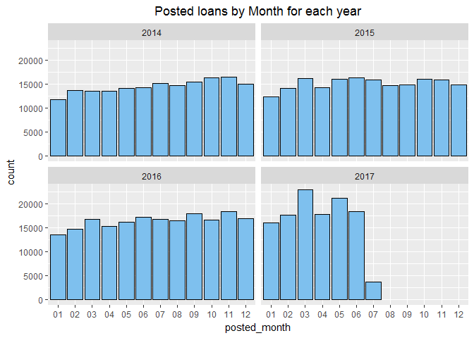<!-- -->

***

### Sectors

Notes:

- The below code find the numbers of records per each unique sector and divides 
it by the total number of whole reocrds to get the percentage of each sector.
- A bar plot was plotted and convereted into a Pie as ggplot does not have pie 
by default.


```r
sector <- data.frame(group = levels(kiva_df$sector), value = c (
dim(kiva_df[which(kiva_df$sector=="Agriculture"),][5])[1]/dim(kiva_df)[1],
dim(kiva_df[which(kiva_df$sector=="Arts"),][5])[1]/dim(kiva_df)[1],
dim(kiva_df[which(kiva_df$sector=="Clothing"),][5])[1]/dim(kiva_df)[1],
dim(kiva_df[which(kiva_df$sector=="Construction"),][5])[1]/dim(kiva_df)[1],
dim(kiva_df[which(kiva_df$sector=="Education"),][5])[1]/dim(kiva_df)[1],
dim(kiva_df[which(kiva_df$sector=="Entertainment"),][5])[1]/dim(kiva_df)[1],
dim(kiva_df[which(kiva_df$sector=="Food"),][5])[1]/dim(kiva_df)[1],
dim(kiva_df[which(kiva_df$sector=="Health"),][5])[1]/dim(kiva_df)[1],
dim(kiva_df[which(kiva_df$sector=="Housing"),][5])[1]/dim(kiva_df)[1],
dim(kiva_df[which(kiva_df$sector=="Manufacturing"),][5])[1]/dim(kiva_df)[1],
dim(kiva_df[which(kiva_df$sector=="Personal Use"),][5])[1]/dim(kiva_df)[1],
dim(kiva_df[which(kiva_df$sector=="Retail"),][5])[1]/dim(kiva_df)[1],
dim(kiva_df[which(kiva_df$sector=="Services"),][5])[1]/dim(kiva_df)[1],
dim(kiva_df[which(kiva_df$sector=="Transportation"),][5])[1]/dim(kiva_df)[1],
dim(kiva_df[which(kiva_df$sector=="Wholesale"),][5])[1]/dim(kiva_df)[1])
)


bp<- ggplot(sector, aes(x="", y=value, fill=group))+
geom_bar(width = 1, stat = "identity")


pie <- bp + coord_polar("y", start=0)
pie +
  ggtitle("Sectors Pie Chart")  +
  theme(plot.title = element_text(hjust = 0.5))
```

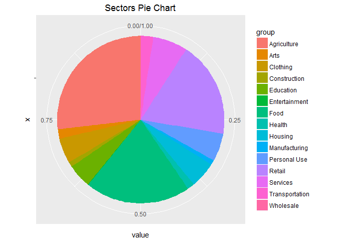<!-- -->


***

### Exploring Groups

Notes:

- We will create a new variable that states whether the loan is taken by a group
or a solely.

**Creating Group Variable**


```r
kiva_df$group <- 0
kiva_df$group <- sapply(kiva_df$borrower_genders, function(x) {ifelse (grepl(',',x),"group", "single")})
```

Notes:

- After that we're going to plot the number of loans for each group and single 
borrowers.
- We're limiting our x-axis to the 10k loans as these are the most frequent 
loans.
- We can see that single borrowers are more compated to groups in the 1st 
half of the data.


```r
ggplot(aes(x = loan_amount), data = kiva_df) +
  geom_histogram(color = 'black', fill = 'skyblue2') +
  facet_wrap(~group) +
  scale_x_continuous(limits = c(0,10000))+
  ggtitle("Loans for Group and Single Borrowers")  +
  theme(plot.title = element_text(hjust = 0.5))
```

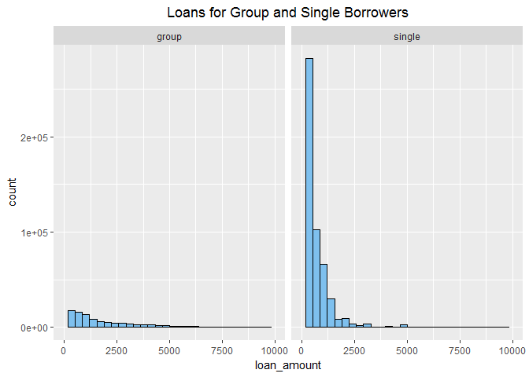<!-- -->

**What's the maximum loans for single and group borrowers?**

The Maximum Loans:

- For Single Borrowers: 100k
- For Group Borrowers: 50k


```r
max(subset(kiva_df, group <= "single",select = loan_amount))
```

```
## [1] 1e+05
```

```r
max(subset(kiva_df, group <= "group",select = loan_amount))
```

```
## [1] 50000
```


**What's the percentage of groups vs. single borrowers?** 

Notes:

- It seems that 15 percent only of the borrowers are in terms of groups.


```r
sort(table(kiva_df$group))
```

```
## 
##  group single 
## 105772 565433
```

```r
as.table(c(sort(table(kiva_df$group))[1]/nrow(kiva_df),sort(table(kiva_df$group))[2]/nrow(kiva_df)))
```

```
##     group    single 
## 0.1575852 0.8424148
```


***

### Exploring Single borrowers with a Scaling 

**What is the quantiles of the loan amount ?**


```r
describe(kiva_df$loan_amount)
```

```
##    vars      n  mean      sd median trimmed    mad min   max range skew
## X1    1 671205 842.4 1198.66    500  602.62 407.71  25 1e+05 99975  9.8
##    kurtosis   se
## X1   312.09 1.46
```

```r
summary(kiva_df$loan_amount)
```

```
##     Min.  1st Qu.   Median     Mean  3rd Qu.     Max. 
##     25.0    275.0    500.0    842.4   1000.0 100000.0
```

Notes:

- As we can see from prior image that the data has a long tail.
- This is because we have outliers deviating from the norm, having most 
observations concenrtated in the beginning of the visual.
- Outliers cause skewness in data, therefore a transformation function of log10
was applied to the data to have it scaled and be presented in the form of a 
normal distribution.


```r
ggplot(aes(x = loan_amount), data = subset(kiva_df, group == "single")) +
  geom_histogram(color = 'black', fill = 'skyblue2') +
  scale_x_log10()+
  ggtitle("Single Borrowers Distribution (Sacle log 10)")  +
  theme(plot.title = element_text(hjust = 0.5))
```

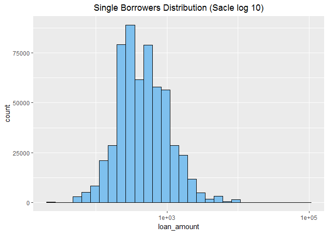<!-- -->

***

**Creating Fund Percentage Variable**

Notes:

- The idea of the Loan percentage is to get the frequency of how many percent 
borrowers are behind.
- Fudned amount will be divided over the loan amount, if the result is 1 this 
means the fund is 100% funded and complete.
- If not, the remaining percent will be printed.


```r
kiva_df$fund_percentage <- kiva_df$funded_amount/kiva_df$loan_amount
kiva_df$fund_percentage <- round(kiva_df$fund_percentage,digits=2)
table(kiva_df$fund_percentage)
```

```
## 
##      0   0.01   0.02   0.03   0.04   0.05   0.06   0.07   0.08   0.09 
##   3452    153    311    263    289    361    285    328    502    262 
##    0.1   0.11   0.12   0.13   0.14   0.15   0.16   0.17   0.18   0.19 
##    473    314    586    245    383    476    292    485    430    424 
##    0.2   0.21   0.22   0.23   0.24   0.25   0.26   0.27   0.28   0.29 
##    559    400    431    342    328    872    329    363    413    542 
##    0.3   0.31   0.32   0.33   0.34   0.35   0.36   0.37   0.38   0.39 
##    635    476    477    645    264    661    505    350    818    420 
##    0.4   0.41   0.42   0.43   0.44   0.45   0.46   0.47   0.48   0.49 
##    613    448    665    503    618    656    495    454    584    299 
##    0.5   0.51   0.52   0.53   0.54   0.55   0.56   0.57   0.58   0.59 
##   1259    281    625    503    509    690    689    665    581    500 
##    0.6   0.61   0.62   0.63   0.64   0.65   0.66   0.67   0.68   0.69 
##    672    448    848    405    529    656    349    734    622    533 
##    0.7   0.71   0.72   0.73   0.74   0.75   0.76   0.77   0.78   0.79 
##    645    535    578    500    433    722    397    425    570    437 
##    0.8   0.81   0.82   0.83   0.84   0.85   0.86   0.87   0.88   0.89 
##    494    486    447    434    295    448    344    233    458    268 
##    0.9   0.91   0.92   0.93   0.94   0.95   0.96   0.97   0.98   0.99 
##    293    224    280    188    166    174     97     80     80     17 
##      1   1.06   1.13 
## 622878      1      1
```

***

### Loan Percentage Visual

Notes:

- A Round funciton of 2.xx will be used so we can have a 100th elements and they
can be plotted all.
- This means we will have a 100 bin, but the x-axis will be limited to have 10
values scaled by 10 from 0 to a 100.


```r
ggplot(aes(x=fund_percentage),data=subset(kiva_df, fund_percentage > 0 & fund_percentage < 1 )) +
  geom_histogram(binwidth = .01, color = 'black', fill = 'skyblue2') +
  scale_x_continuous(breaks = seq(0.00,0.99,0.05)) +
  scale_y_continuous(breaks = seq(0,1250,100)) +
  ggtitle("Non-Refunded Loan Percentage")  +
  theme(plot.title = element_text(hjust = 0.5))
```

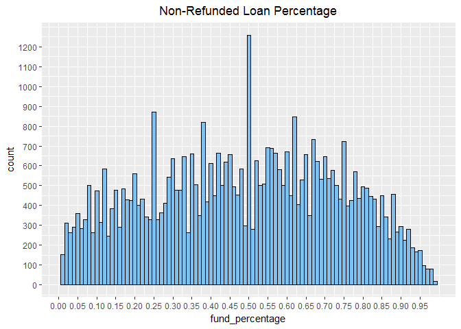<!-- -->

**Creating Single Gender Variable**

Notes:

- We will create another variable for single gender wich states either male/female
- This will be used for coloring upon genders in ggplot frequency polygon later.


```r
kiva_df$single_gender <- 0
kiva_df$single_gender <- 
mapply(function(x) if(grepl(",",x)){
  return <- "group"
 }else{
   if(x == "female")
   {return <- "female"}
   else{return <- "male"}
   } , kiva_df$borrower_genders)
```


**Loan Status: Paid / Not-Paid**

Notes:

- By function is used to present summary across Males, Females and groups.
- Note that the average loan amount for females is around 590s and for males 
around 900s. The goup has a larger mean of 1125$.


```r
kiva_df$loan_status <- sapply(kiva_df$fund_percentage, function(x) {ifelse (x >= 1,"Paid", "NotPaid")})
by(kiva_df$loan_amount, kiva_df$single_gender, summary)
```

```
## kiva_df$single_gender: female
##     Min.  1st Qu.   Median     Mean  3rd Qu.     Max. 
##     25.0    250.0    400.0    593.1    675.0 100000.0 
## -------------------------------------------------------- 
## kiva_df$single_gender: group
##    Min. 1st Qu.  Median    Mean 3rd Qu.    Max. 
##      25     525    1125    1762    2575   50000 
## -------------------------------------------------------- 
## kiva_df$single_gender: male
##    Min. 1st Qu.  Median    Mean 3rd Qu.    Max. 
##    25.0   350.0   600.0   907.4  1050.0 50000.0
```


***

### Males / Females proportions 


```r
single_gender_count=nrow(subset(kiva_df, single_gender != 'group', select = single_gender))

single_gender_data = data.frame(as.table(c(table(subset(kiva_df, single_gender != 'group', select = single_gender))[1]/single_gender_count,table(subset(kiva_df, single_gender != 'group', select = single_gender))[2]/single_gender_count)))


plot_ly(single_gender_data, labels = ~Var1, values = ~Freq, type='pie', marker = list(colors = c('pink','skyblue')))  %>%
  layout(title = 'Male and Female proportions',
         xaxis = list(showgrid = FALSE, zeroline = FALSE, showticklabels = FALSE),
         yaxis = list(showgrid = FALSE, zeroline = FALSE, showticklabels = FALSE))
```

***

### Repayment Intervals Boxplot

Notes:

- Box plot for loans accross each interval.
- We have 4 intervals of monthly, weekly, irregular and Bullet.
- A cartesian layer is added for a better view.


```r
ggplot(aes(x=repayment_interval, y=loan_amount),data=kiva_df) +
  geom_boxplot(aes(fill = repayment_interval)) +
  scale_fill_manual(values=wes_palette(n=4, name="GrandBudapest2")) +
  scale_y_continuous(limits = c(0,2000), breaks=seq(0,2000,100)) +
  coord_cartesian(ylim = c(0,1000)) +
  ggtitle("Repayment Interval Loans Ammount")  +
  theme(plot.title = element_text(hjust = 0.5))
```

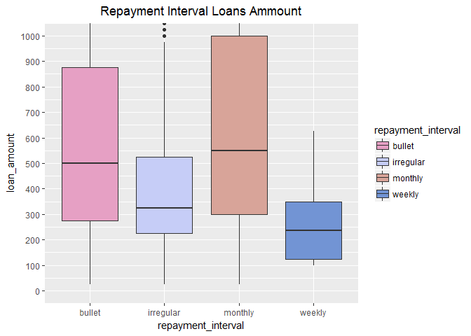<!-- -->


***

### Male/Female laon ammount proportions Frequency Polygon

Notes:

- The idea of this frequency polygon is to plot the loan ammount for both genders.
- This will be only for single borrowers not groups as we can differentiate 
between the genders.
- A limitation of 5000 was added as the 10k loans is less frequent.
- Two plots are compared, one with scale log10 for a normal distribution and 
another long tailed one.


```r
## Creating Single_gender so we can color the male/female proportionals in the below frequency polygon.

p1 <- ggplot(aes(x = loan_amount, y = ..count../sum(..count..)), data = subset(kiva_df, group != "group")) +
  geom_freqpoly(aes(color = single_gender)) +
  scale_x_log10() +
  ggtitle("Gender proportions with loan amount (scale log10)")  +
  theme(plot.title = element_text(hjust = 0.5, size = 10))

p2 <- ggplot(aes(x = loan_amount, y = ..count../sum(..count..)), data = subset(kiva_df, group != "group")) +
  geom_freqpoly(aes(color = single_gender)) +
  scale_x_continuous(limits = c(0,5000), breaks = seq(0,5000,500)) +
  ggtitle("Gender proportions with loan amount (on-scalar)")  +
  theme(plot.title = element_text(hjust = 0.5, size = 10))

grid.arrange(p1,p2, ncol = 1) 
```

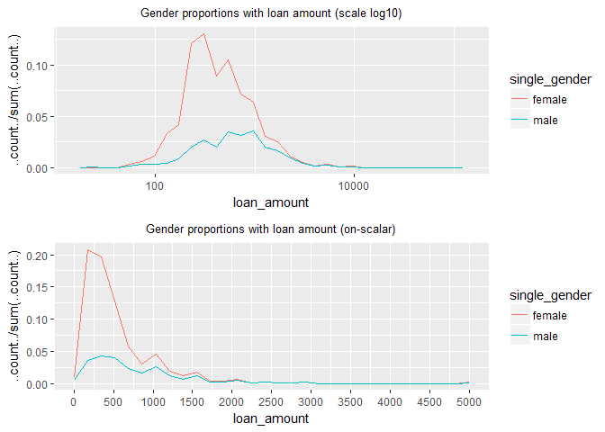<!-- -->

***

### Loan status ammount proportions 

Notes:

- The below plot had the loan amount smoothed by 250 since the initial graph had
noise.
- We can notice that there is a difference in proportions between loans that are
between 1000 and 2500.


```r
ggplot(aes(x=round(loan_amount/250)*250, group = loan_status), data = subset(kiva_df,loan_amount<10000)) +
geom_line(aes(y = ..prop.., color = loan_status), stat="count") +
scale_y_continuous(labels=scales::percent) +
  ggtitle("Loan status proportions")  +
  theme(plot.title = element_text(hjust = 0.5))
```

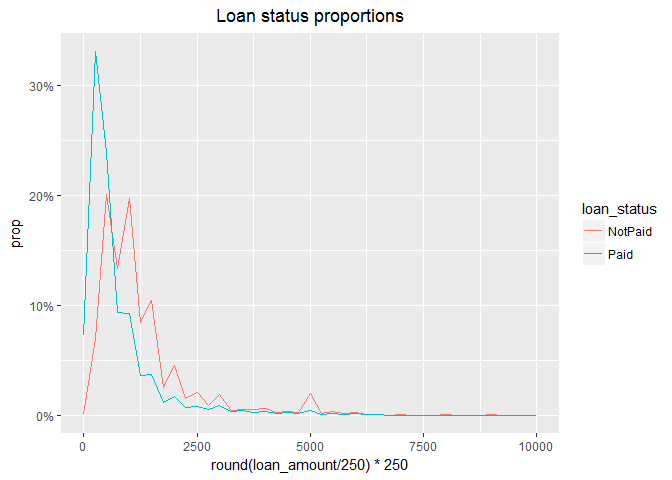<!-- -->

# Univariate Analysis

- Philippines is the most accounted country for borrwers, followed by Kenya and 
El-Salvador.
- Philippines doubles the loan amount of the second highest country 'Kenya'.
- Posted loans seem to the least at the beginning of each year.
- Most loans are for agriculture followed by food then retail.
- Only 15% of borrwers are group borrowers, the other 85% are single borrwers.
- Maximum loan for single borrowers is 100k while for group borrowers is 50k. 
(100k is considered outlier since it only occurred once and our median is 500 
dollars)
- Since we have a long distant outlier, our data seems to be long tailed right 
skewed. Applying scale like log10 would be needed to normally represent our data.

***
### What is the structure of your dataset?

- The dataset is structured initially of 20 variable and  671,205 observations.
- The data seems clean however, it conatains NA Variables.
- The dataset has NA values in partner_id and it does not have duplicate rows.

***

### What is/are the main feature(s) of interest in your dataset?

- The most important feature would be the loan_amount, It's similar to price in
other datasets, and it is crucial to understand what other features impacts it.
- Other variables that would seem to be related / impacting to it would be:
+ funded_amount
+ sector
+ country
+ gender 
+ repayment_interval

***

### What other features in the dataset do you think will help support your 
investigation into your feature(s) of interest?

Date will help spporting the analysis, however date is in discerete value, which
is why I wrote a function to trim, so aggregations would be made based on days,
months or years.

lender count would be handy in bivartes to try and understand how it is related 
to laon_amount or not.

Is the amount of loan directly proportional to the lender count? In otherwords,
if the loan amount increased does it requires more lenders?

***

### Did you create any new variables from existing variables in the dataset?

The dataset is missing important variable that could come in handy, which is why
the below variables are created:

-1- Posted_year        The year the loan was posted in
-2- Posted_month       The month the loan was posted in
-3- Posted_day         The day the loan was posted in
-4- loan_status        The status of the loan.{whether it's fully paid or not}
-5- funded_percentage  How many percent is the loan disbursed behind.
-6- group              Whether the borrowers are single or in a group
-7- single_gender      The gender of the single borrower

***

### Of the features you investigated, were there any unusual distributions? 
Did you perform any operations on the data to tidy, adjust, or change the form 
of the data? If so, why did you do this?

- Yes, Most of loans are under 50,000 dollars and even more under 10,000 dollars.
- Yes, somtimes subset is/will be used or transforming function on scales of 
ggplot or even rounding, dividing and multiplying loan_amount to be neatly 
represented.

***


# Bivariate Plots Section

### Relationship between Loan Amount and numer of lenders

Notes:

- As described earlier, we only have one loan with 100k which seems an outlier.
- We also have a small percent of data under 50k loans, and most data seem to 
fall under 10k.
- **Hint:** These prices are in USD dollars, which makes them unified for all 
other countries.


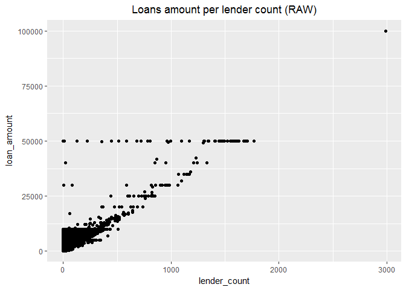<!-- -->


**Would be a co-relation between loand_amount and lender_count ?**

Notes:

- We can see a very strong postive corelation of approximately 0.8 between 
lender count and loan_amount.


```r
cor.test(kiva_df$loan_amount,kiva_df$lender_count, method = 'pearson')
```

```
## 
## 	Pearson's product-moment correlation
## 
## data:  kiva_df$loan_amount and kiva_df$lender_count
## t = 1087.4, df = 671200, p-value < 2.2e-16
## alternative hypothesis: true correlation is not equal to 0
## 95 percent confidence interval:
##  0.7978295 0.7995620
## sample estimates:
##       cor 
## 0.7986974
```

Notes:

- Data was subseted here to have loans under 10k and lenders beneath 500.
- We can see vertical straight lines under discerete values of loans such as:
1000,2000,3000, etc. as this seems more reasonable where borrower won't include
change or other extra dollars in his loan.
- Most loans are from small dollars to 3000 dollars, a jitter was used with alpha
1/30 having each 30 points represted as 1 and the lesser points would be 
transperant.
- We can see a direct proportion co-relation between lender_count and lender_amount,
the higher the loan is the higher the lenders are. This makes sense as kiva would
represent higher loans with more people's donations.


```r
Lender_Loan_Corelation <- ggplot(aes(x = loan_amount, y = lender_count), data=subset(kiva_df, loan_amount < 10000 & lender_count < 500 )) +
  geom_point(alpha = 1/30,position = position_jitter(h = 0)) +
  geom_smooth(method = 'lm', color = 'red') +
  scale_x_continuous(breaks = seq(0,10000,1000)) +
  ggtitle("Lender count and Loan amount corelation")  +
  theme(plot.title = element_text(hjust = 0.5))  
Lender_Loan_Corelation
```

<!-- -->

***

### Loan amount versus Loan funded

**Would be a co-relation between loand_amount and funded_amount ?**

Notes:

-  we can even see higher a stronger corelation between loan and funded amount.


```r
cor.test(kiva_df$loan_amount,kiva_df$funded_amount, method = 'pearson')
```

```
## 
## 	Pearson's product-moment correlation
## 
## data:  kiva_df$loan_amount and kiva_df$funded_amount
## t = 2368.1, df = 671200, p-value < 2.2e-16
## alternative hypothesis: true correlation is not equal to 0
## 95 percent confidence interval:
##  0.9447877 0.9452991
## sample estimates:
##      cor 
## 0.945044
```

Notes:

- As noted, most borrowers are able to pay their loan.
- However, most of borrowers whom lack to pay their loan seem to fall under 
loans with 1500 dollars.


```r
ggplot(aes(x = loan_amount, y = funded_amount) ,data = kiva_df) +
  geom_point(alpha = 1/50) +
  scale_x_continuous(limits = c(0, quantile(kiva_df$loan_amount, 0.99)), breaks = seq(0,5000,500)) +
  scale_y_continuous(limits = c(0, quantile(kiva_df$funded_amount, 0.99)), breaks = seq(0,5000,500)) +
  ggtitle("Funded amount and Loan amount corelation")  +
  theme(plot.title = element_text(hjust = 0.5))  
```

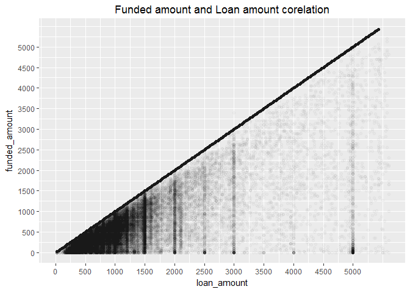<!-- -->

**How many percent of loans are not funded?**


```r
## Loan percentage
as.table(c(sort(table(kiva_df$loan_status))[1]/nrow(kiva_df),sort(table(kiva_df$loan_status))[2]/nrow(kiva_df)))
```

```
##    NotPaid       Paid 
## 0.07199738 0.92800262
```

***

### Payment Intervls with funded

Notes:

**Do Loans with high price have longer repayment terms? Is there a relation?**

- The answer is No, there is no relation.
- However, we can see higher loans have lower repayement interval.


```r
ggplot(data = subset(kiva_df, loan_amount < 10000 & term_in_months<=120), aes(x = round(loan_amount/100)*100, y = term_in_months/12)) +
  geom_jitter(alpha = 1/20) +
  geom_line(stat = 'summary', fun.y = mean, color = 'red')+
  scale_y_continuous(breaks = seq(0,10,1)) +
  ggtitle("Loan amount with repayment intervals")  +
  theme(plot.title = element_text(hjust = 0.5)) +
  xlab("Loan amount") +
  ylab("years")
```

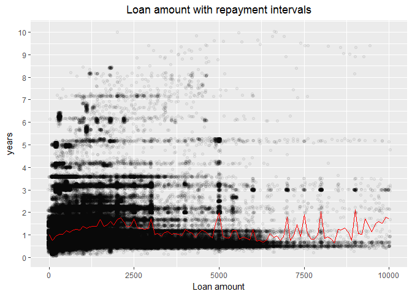<!-- -->


***

### Conditional Means:Loan mean per each Year's month

Notes:

- The idea about this visual is interesting, since I've have wrote a function 
that trims date, I will trim the date by year and month so I can have each month
in each year.
- After that I will get the loan mean, median and count of each loan within that
date.


```r
date_groups <- group_by(kiva_df, trimDate(kiva_df$posted_time,'%y-%m'))
kiva_df.date_by_loan <- summarise(date_groups,
          loan_group_mean = mean(loan_amount),
          loan_group_median = median(loan_amount),
          n = n())
colnames(kiva_df.date_by_loan)[1] <- "MonthOfYear"
kiva_df.date_by_loan <- arrange(kiva_df.date_by_loan)
head(kiva_df.date_by_loan)
```

```
## # A tibble: 6 x 4
##   MonthOfYear loan_group_mean loan_group_median     n
##   <chr>                 <dbl>             <dbl> <int>
## 1 14-01                  913.              525. 11735
## 2 14-02                  926.              525. 13697
## 3 14-03                  891.              525. 13627
## 4 14-04                  902.              525. 13509
## 5 14-05                  852.              525. 14108
## 6 14-06                  880.              500. 14301
```

***

### Loan means grouped by each year's month

Notes:

- I will use the prevoius dataframe then, to plot the mean of each loan in each
month of each year.
- The visual below is scaled by each 3 month period so we can see the quarters
of the years we have.
- We can see the range of loan mean is between 700s and 900s which does not scale
much.


```r
ggplot(aes(x = MonthOfYear , y = loan_group_mean), data = kiva_df.date_by_loan) + 
  geom_point(aes(color = (substr(kiva_df.date_by_loan$MonthOfYear,1,2))), show.legend = FALSE) +
  scale_x_discrete(breaks = unique(kiva_df.date_by_loan$MonthOfYear)[seq(0,43,3)]) + 
  scale_y_continuous(breaks = seq(700,950,25)) +
  scale_color_brewer(palette="Dark2") +
  ggtitle("Conditional Mean: Average of loan per each year's month")  +
  theme(plot.title = element_text(hjust = 0.5))  
```

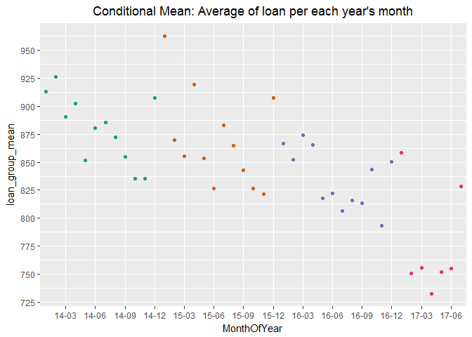<!-- -->

***

### Sector by loan count Versus Sector by loan mean 

Notes:

- The below two visuals demonstrat an interesting comparisons.
- Although we have agriculture as the highest count(180ks), the highest mean 
seems  to be Entertainment which was in the bottom with a count of only in the 
800s.
- It seems that Entertainment sector below has the highest loan_mean.

**Could Entertainment have the highest loan_amount 100K? which makes it top mean with al ower count?**


```r
## Highest Loan sector/value ##
kiva_df[which(kiva_df$loan_amount==max(kiva_df$loan_amount)),][c(2,4)]
```

```
##       funded_amount    activity
## 70500         1e+05 Agriculture
```


```r
## Entertainment Stats. ##
with(subset(kiva_df,sector == "Entertainment"), describe(loan_amount))
```

```
##    vars   n    mean      sd median trimmed    mad min   max range skew
## X1    1 830 1673.67 2014.43  887.5  1255.2 759.83  25 10000  9975 2.25
##    kurtosis    se
## X1     5.35 69.92
```

```r
## Agrictulre Stats.##
with(subset(kiva_df,sector == "Agriculture"), describe(loan_amount))
```

```
##    vars      n   mean      sd median trimmed    mad min   max range skew
## X1    1 180302 793.49 1068.46    500  618.39 407.71  25 1e+05 99975   18
##    kurtosis   se
## X1   913.01 2.52
```

- Nope it does not. The highest loan comes from Agriculture.
- However, the Entertainment has a mean of 1600s with a median of 800s, a 10k 
loan has given that lower count a boost.


```r
kiva_df.sector_by_loan <- kiva_df %>%
  group_by(sector) %>%
  summarise(loan_amount_mean = mean(loan_amount),
            funded_amount_mean = mean(funded_amount),
            count=n()) %>%
  arrange(desc(count))  %>%
  ungroup() %>%
  mutate(sector = reorder(sector,count))


p1 <- ggplot(aes(x = sector, y = count), data = kiva_df.sector_by_loan) +
  geom_bar(stat="identity",colour="black", fill = 'skyblue2') +
  coord_flip() +
  geom_text(aes(x = sector, y = 1, label = paste0(" ",round(count,1)," ",sep="")),
            hjust=0, vjust=.5, size = 3, colour = 'black') +
    ggtitle("Loan per Sector count")  +
  theme(plot.title = element_text(hjust = 0.5, size=10))  

#===============================================================================

kiva_df.sector_by_loan <- kiva_df %>%
  group_by(sector) %>%
  summarise(loan_amount_mean = mean(loan_amount),
            funded_amount_mean = mean(funded_amount),
            count=n()) %>%
  arrange(desc(loan_amount_mean))  %>%
  ungroup() %>%
  mutate(sector = reorder(sector,loan_amount_mean))


p2 <- ggplot(aes(x = sector, y = loan_amount_mean), data = kiva_df.sector_by_loan) +
  geom_bar(stat="identity",colour="black", fill = 'skyblue2') +
  coord_flip() +
 geom_text(aes(x = sector, y = 1, label = paste0(" ",round(loan_amount_mean,1)," ",sep="")),
            hjust=0, vjust=.5, size = 3, colour = 'black') + 
  ggtitle("Loan per sector average")  +
  theme(plot.title = element_text(hjust = 0.5, size=10))  

grid.arrange(p1,p2, ncol = 1, widths = 150)
```

<!-- -->

***

# Bivariate Analysis

- We can see a linear corelation between loan amount and lender count. with a
R-Value of 0.94
- Such a relation is visible for loans up to 10k in a consistent matter.
- Another relation was found between funded amount and loan amount, where most
of loans were paid. Only 7% of loans were paid and 83% were fully paid.
- In Uni-Variate analysis, two loans were found to exceed 100%. One was 106% and
the other was 113%. This could be either a mistake in data or borrowers could've
paid extra, or had fine to pay.
- A conditinoal mean of loans per each month of each year was done, and the 
result was that the loan amount group mean was close with values between 
700s-900s.
- Agrictulture accounted for the highest loan count, however Entertainment which 
accounted for a lower loan count was the highest loan amount. This is because
the Entertainment loan mean/median meaning loans for Entertainment sector costs
a lot.

***
### Talk about some of the relationships you observed in this part of the 
investigation. How did the feature(s) of interest vary with other features in 
the dataset?

- Previously loan amount was selected to be our target spotted vector were I was
trying to understand how it's impacted by other features.
- Features of interested such lenders count and funded amount were found to have
a direct propotional relationship with the loan amount.

***
### Did you observe any interesting relationships between the other features 
(not the main feature(s) of interest)?

- Yes, loans term of month with loan amount.
- It was expected that loans with higher amount would have large window of 
repayment, but the inverse was found. There wasn't a rigid relation ship.
- Explortaion was done for loans less than 10K and 10 years.

***
### What was the strongest relationship you found?

1- Loan amount with funded amount. (which makes sense as 93% of loans are paid)
2- Loan amount with lender count, this is an interesting one, as the bigger the
loan the more lenders kiva require to post a loan.

***


# Multivariate Plots Section


### Top Countries granting loans

Notes:

- Top borrower countries by loan count and sector type.
- Agriculture is the most dominating sector, followed by food.

```r

# To change plot order of bars, change levels in underlying factor
reorder_size <- function(x) {
  factor(x, levels = names(sort(table(x))))
}

frequent_loans <- kiva_df[kiva_df$country_code %in% head(country_ordered$country,10),][c(3,5,7)]

colourCount = length(unique(kiva_df$sector))
getPalette = colorRampPalette(brewer.pal(9, "Set3"))

Top_Countries_Granting_Loans <- ggplot(frequent_loans, aes(reorder_size(country_code))) +
  geom_bar(aes(fill=factor(sector)), width = 0.8, col='black') + theme(axis.text.x = element_text(angle=65, vjust=0.6)) +
  xlab("country")  + 
  scale_fill_manual(values = getPalette(colourCount)) +
  ggtitle(" Top Countries granting loans by Sectors")  +
  theme(plot.title = element_text(hjust = 0.5))  

Top_Countries_Granting_Loans
```

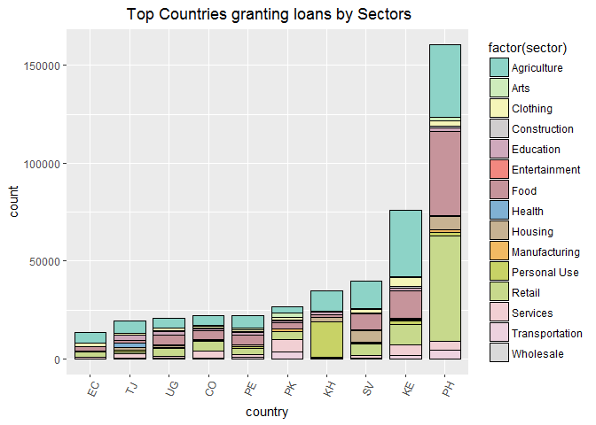<!-- -->

***

**Loan payment status proportions by sectors**

Notes:

- The idea here is to get the proportion/percentage of each sector only afer
groupy by sector and loan status, so we would have the percentage of paid and
non-paid for each sector.
- This was done via group_by and dataset transformation %>% from dply package.


```r
kiva_df.sector_status_prop <- subset(kiva_df,loan_amount<50000) %>%
  group_by(sector,loan_status) %>%
  summarise(count=n(), loan_amount_median=median(loan_amount)) %>%
  mutate(percentage = count / sum(count)*100) %>%
  arrange(desc(sector))

head(kiva_df.sector_status_prop,6)
```

```
## # A tibble: 6 x 5
## # Groups:   sector [3]
##   sector         loan_status count loan_amount_median percentage
##   <fct>          <chr>       <int>              <dbl>      <dbl>
## 1 Wholesale      NotPaid        20              2400.       3.16
## 2 Wholesale      Paid          612               900.      96.8 
## 3 Transportation NotPaid      1721               975.      11.1 
## 4 Transportation Paid        13795               425.      88.9 
## 5 Services       NotPaid      3888              1050.       8.61
## 6 Services       Paid        41250               500.      91.4
```

***

Notes:

 - Not Paid loans seem to have higher loan value than paid ones.
 - The count number of such unpaid loans are small though.
 - The last visual demonstrates the percentage of paid/unpaid proportions.


```r
p1.sector_loanstatus_mean <- qplot(x = sector, y=loan_amount_median, group(sector), data = kiva_df.sector_status_prop) +
  geom_bar(aes(fill=loan_status),stat="identity") +
  coord_flip() +
  scale_fill_manual(values=wes_palette(n=2, name="Moonrise3")) +
  ggtitle("Loan payment status by sector (Loan median)")  +
  theme(plot.title = element_text(hjust = 0.5, size = 11)) 

p2.sector_loanstatus_count <- qplot(x = sector, y=count, group(sector), data = kiva_df.sector_status_prop) +
  geom_bar(aes(fill=loan_status),stat="identity") +
  coord_flip() +
  scale_fill_manual(values=wes_palette(n=2, name="Moonrise3")) +
  ggtitle("Loan payment status by sector (Count)")  +
  theme(plot.title = element_text(hjust = 0.5, size = 11)) 

p3.sector_loanstatus_percentage <- qplot(x = sector, y=percentage, group(sector), data = kiva_df.sector_status_prop) +
  geom_bar(aes(fill=loan_status),stat="identity") +
  coord_flip() +
  scale_fill_manual(values=wes_palette(n=2, name="Moonrise3"))+
  ggtitle("Loan payment status by sector (Percentage)")  +
  theme(plot.title = element_text(hjust = 0.5, size = 11)) 

grid.arrange(p1.sector_loanstatus_mean,p2.sector_loanstatus_count)
```

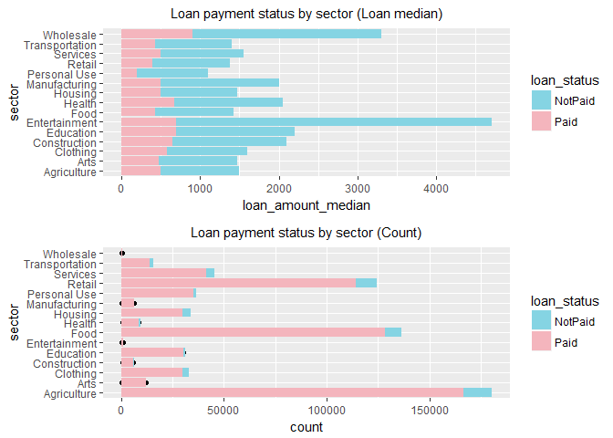<!-- -->

```r
p3.sector_loanstatus_percentage
```

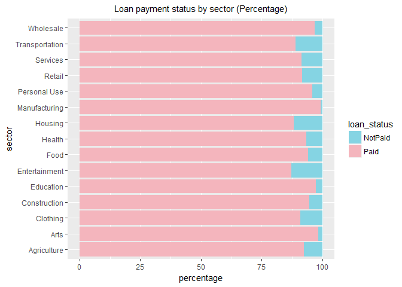<!-- -->


```r
with((subset(kiva_df,loan_amount<50000 & group != 'group')), by(sector, single_gender, summary))
```

```
## single_gender: female
##    Agriculture           Arts       Clothing   Construction      Education 
##          99599           8834          22795           2488          18024 
##  Entertainment           Food         Health        Housing  Manufacturing 
##            389          98762           5261          23024           3206 
##   Personal Use         Retail       Services Transportation      Wholesale 
##           8834          96528          30390           8046            308 
## -------------------------------------------------------- 
## single_gender: male
##    Agriculture           Arts       Clothing   Construction      Education 
##          49202           1288           2921           3184          11970 
##  Entertainment           Food         Health        Housing  Manufacturing 
##            405          15319           2990           8513           2382 
##   Personal Use         Retail       Services Transportation      Wholesale 
##           7995          15016          10494           6955            271
```

### Gender domintation in Sectors 

Notes:

- This visual plots the male/female domintation in the sectors.
- A seperate dataframe was also create to plot the percentage after grouping 
males and females.


```r
kiva_df.sector_gender_prop <- subset(kiva_df,loan_amount<50000  & group != 'group') %>%
  group_by(sector,single_gender) %>%
  summarise(count=n(), loan_amount_median=median(loan_amount)) %>%
  mutate(percentage = count / sum(count)*100) %>%
  arrange(desc(sector))

head(kiva_df.sector_gender_prop,4)
```

```
## # A tibble: 4 x 5
## # Groups:   sector [2]
##   sector         single_gender count loan_amount_median percentage
##   <fct>          <chr>         <int>              <dbl>      <dbl>
## 1 Wholesale      female          308               538.       53.2
## 2 Wholesale      male            271              1175.       46.8
## 3 Transportation female         8046               400.       53.6
## 4 Transportation male           6955               600.       46.4
```

Notes:

- Proportions of male vs. females
- It's intresting as we females domintating in the below sectors:
+ Services
+ Retail
+ Housing
+ Food
+ Clothing
+ Arts
- Male seem to be domintating in:
+ Counstruction
+ Entertainment


```r
Gender_domination <- qplot(x = sector, y=percentage, group(sector), data = kiva_df.sector_gender_prop) +
  geom_bar(aes(fill=single_gender),stat="identity") + 
  scale_y_continuous(breaks = seq(0,100,10)) +
  coord_flip() +
  scale_fill_manual(values=wes_palette(n=2, name="Moonrise3")) +
  ggtitle("Gender domintation in sectors")  +
  theme(plot.title = element_text(hjust = 0.5, size = 11)) 
Gender_domination
```

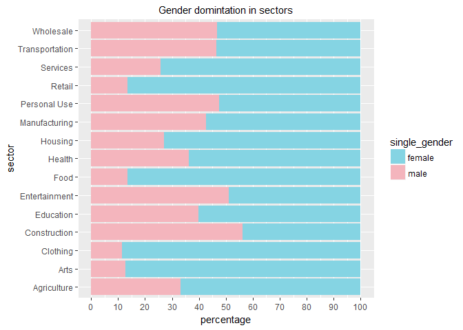<!-- -->

***

### Genders proportions for loan amount per sector

Notes:

- Note that the percentage of genders is for the whole dataset and not per 
sectors/bins.
- We can see that the highest number is males in Agriculture 35%, we also see a
huge number of femailes 22.6% in retail.


```r
ggplot(aes(x = sector, y = loan_amount ,group=single_gender), data =  subset(kiva_df,loan_amount<10000 & group != 'group') ) +
  geom_bar(aes(fill = single_gender), stat = "identity") + 
  geom_text(aes( label = scales::percent(..prop..),y= ..prop.. ), stat= "count", vjust = 0.5, hjust = 0, size = 2.5) +
  coord_flip() +
  facet_wrap(~single_gender) +
  scale_y_continuous(limits = c(0,10000)) +
  scale_fill_manual(values=wes_palette(n=2, name="Moonrise3")) +
  ggtitle("Genders proportions for loan amount per sector")  +
  theme(plot.title = element_text(hjust = 0.5, size = 11)) 
```

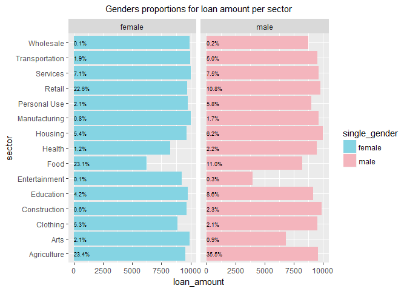<!-- -->


***

### Genders loan amount per each sector

Notes:

- The below visual states the loan amount taken for each gender.
- The dataset again was cut for loans under 10k and groups were excluded.
- Genders seem to be close!


```r
ggplot(aes(x = sector, y = loan_amount, group=single_gender), data =  subset(kiva_df,loan_amount<10000 & group != 'group') ) +
  geom_bar(aes(fill = single_gender), stat = "identity", position = "dodge") + 
  coord_flip() +
  scale_fill_manual(values=wes_palette(n=2, name="Moonrise3")) +
  ggtitle("Genders loan amount per each sector")  +
  theme(plot.title = element_text(hjust = 0.5, size = 11)) 
```

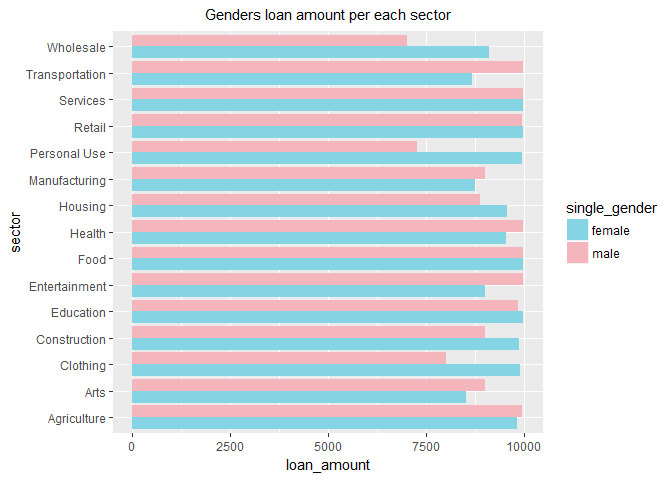<!-- -->

***

### Loan payment intervals per each sector

Notes:

- Most loans are accounted for monthly use followed by irregular.
- Weekly loans seems scarce.


```r
ggplot(aes(x = sector, y = loan_amount/1000), data = subset(kiva_df,loan_amount<10000))+
  geom_bar(aes(fill = repayment_interval),stat="identity") +
  coord_flip() +
  scale_y_continuous(labels = comma, breaks = seq(0,150000,25000)) + 
  scale_fill_manual(values=wes_palette(n=4, name="GrandBudapest2")) +
  xlab("Loan amount divided by 1000")  +
  ggtitle("Loan payment intervals per each sector")  +
  theme(plot.title = element_text(hjust = 0.5, size = 11)) 
```

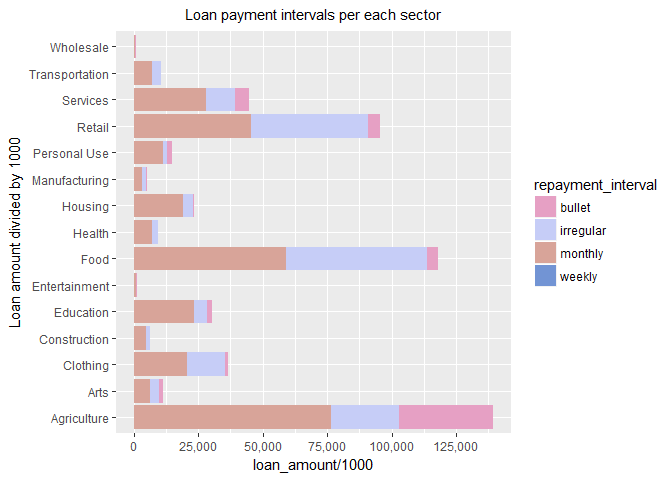<!-- -->


# Multivariate Analysis

- Most loan count seem to be from Agriculture across the top ten borrower 
countries.
- Retail seems to be the biggest bin across count for the top borrwer country (PH)
and across the whole dataset as well.
- Not Paid loans seem to have higher loan value than paid ones.
- The count percentage of unpaid loans are relatively small to the paid ones.
- There is no huge difference btween distribution of male and females across 
sector, females are domintaing in some sectors.
- Genders seem to be close in loan amount for each sector when they were grouped
upon gender.
- Most loans are accounted for monthly use followed by irregular and weekly ones
are scarce.

***

### Talk about some of the relationships you observed in this part of the \
investigation. Were there features that strengthened each other in terms of \
looking at your feature(s) of interest?

- Not much, most features had genders and loan status to see how they are 
distributed.

***

### Were there any interesting or surprising interactions between features?

- An interesting intution was seeing females dominating in below fields, which
made kind of sense.
+ Services
+ Retail
+ Housing
+ Food
+ Clothing
+ Arts

***

# Final Plots and Summary

### Plot One
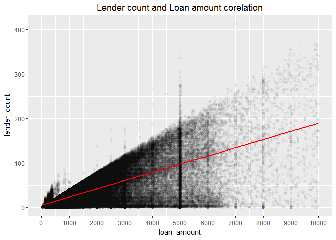<!-- -->

***

### Description One

The interesting part about this plot, is when the loan amount increases, the
lenders count increases. This makes sense as kiva organization requires more lender
to support a larger loan amount.

***

### Plot Two
<!-- -->

***

### Description Two

The intresting part about this plot is the domination of genders which reflects
the real life scenarios were we see males dominating in heavy liftiing services
such as construction andwomen dominating in housing, services, food etc.

***

### Plot Three
<!-- -->

***

### Description Three

------

Here we can see Agriculture dominating as top sector across all countries.
A function was wrote to order the bins in  savvy way inside the ggplot, we see
also a big  amount of food Retail dominating in PH and other countries.

***

# Reflection

- Philipines accounts for a large number of posted loans that double the second 
top-most country Kenya.
- Most loans are under 10k dollars.
- Most loans are for agriculture.
- 93% of loans were paid or the money was fully raised by kiva.
- 85% of borrowers joined as single and not group borrowers.
- 75% of single borrowers were females and 25 were males excluding groups.
- Monthly was the most frequent payment interval.
- Most Unpaid loans or not fully funded loans were loans bigger than 500$
- Loan mean was close across years from 2014 till mid of 2017 between 700s and
900s.


##### What were some of the struggles that you went through?

- Multivariate analysis, when trying to unify the percentage of single genders
across each sector as a bin on the y-axis while having the loan on x-axis. This
was hard as you need to group on sectors and single_genders then get the percentage.

It's easy to do it on dataset but on with ggplot. This was resolved by dividing
the plot into two plots.

##### What went well? 

- Creating new variables while looping through the whole dataset via mapply and
sapply.


##### What was surprising? 

- Co-Relations between loan amount and funded amount.
- Females as a large percentage. (75%)
-  PH as a country havgin 180k loans count.


</span>
